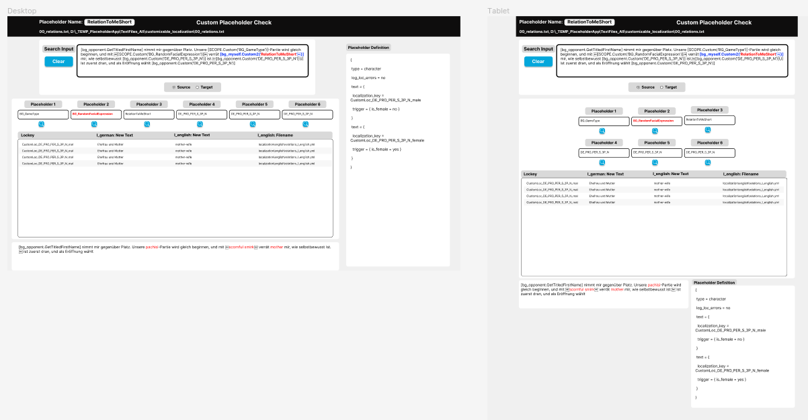

# FilemakerPlaceholderSearch
Web app for querying Filemaker database over REST API.

This Web app is essentially a copy of an app that exists on the Filemaker server. This Web app relies on calculations performed by that Filemaker App in real time, based on the search input string sent by this Web App, and the information the Filemaker App then returns to this Web app.

This Web App makes us of the fmRESTor library and actions as found here:
https://github.com/24u/fmRESTor.php/blob/50405db1572bd5d7f48b7030b89c5ed82426c9b3/LICENSE

## Design
### Original Design
The design is essentially a copy of the original Filemaker app. 
It was decided that, due to the nature and purpose of the Web App, only Desktop and Tablet version were needed. 
Additions such as language options and Suffix data were added later.

## Documentation

### Overview
This can be broken down into 4 main parts:
1. This Web App updates the SearchInput Global Field on the Filemaker App
2. This Web App tells the Filemaker App to run a script on each of its Placeholder Value Fields.
3. The Filemaker App returns the results of the script (each time) to this Web App.
4. This Web App displays the response as depending on which options are selected. 

### Process
1. User enters input into SearchInput TextArea.
2. The SearchInput component passes the input updates back up to App.js and updates the state SearchInputValue. 
3. User clicks Search. The SearchInput component passes the action back up to App.js.
4. App resets all state data in App.js except SearchInputValue (and user credentials).
5. App checks whether user credentials are present in state data. If not, it requests them over simple browser prompts and stores them in the state data. If the credentials fail (or if there is a general error), the entered credentials are deleted and an alert is displayed to try again or contact support. 
6. App sends entered string to Filemaker (using fmRESTor library action "setGlobalField")
7. App waits 0.5 seconds (setTimeout). This is included to allow Filemaker to perform calculations. There is currently no way around this, and the delay has been included on request.
8. Based on the length of an array of extracted placeholders, the App sends the fmRESTor library action "runScript" with the argument "First", "Second" etc. up to maximum "Sixth".
9. Like there are six placeholder value fields in this Web App, so there are six in the server-based Filemaker App. 
10. Each time the script is sent, Filemaker performs some internal actions and returns a response with all the data for that search value field. All the responses are stored together in an array.
11. For each response, this Web App displays the Placeholder name in the placeholder search value field as taken from that response.
12. The user clicks on the spyglass associated with a placeholder search value. The PlaceholderSearch component passes the placeholder number back up to App.js
13. This Web App updates the relevant state data in App.js for that search value field.
14. The data is passed from App.js to the components as props.
15. The components handle which data they display (passed in as props), based on the selected options. 